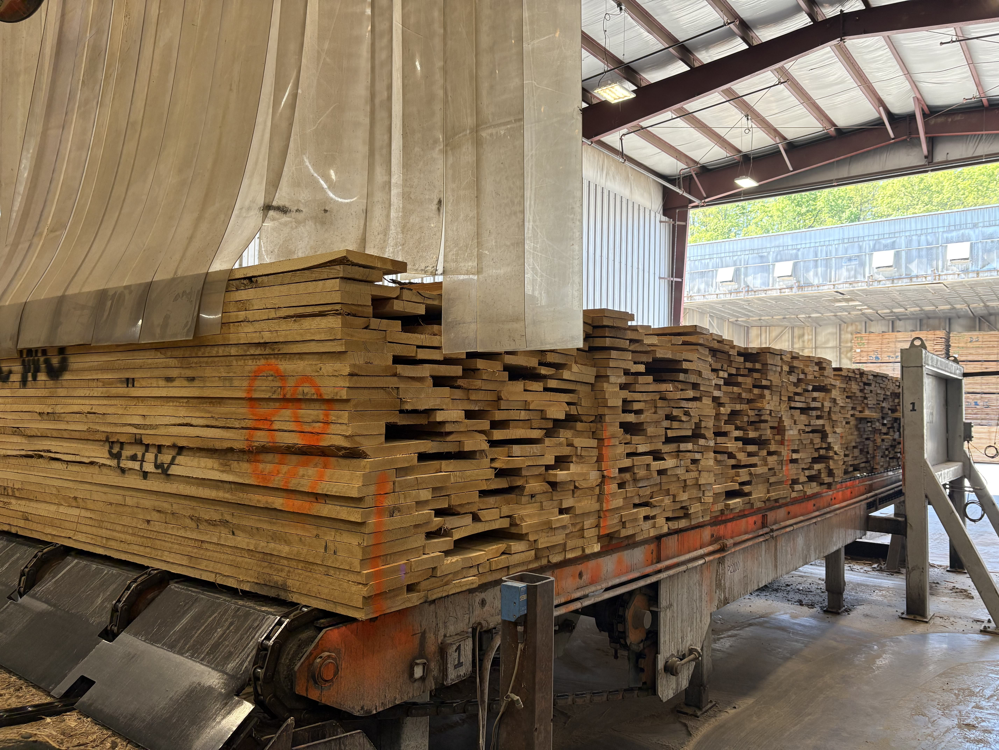
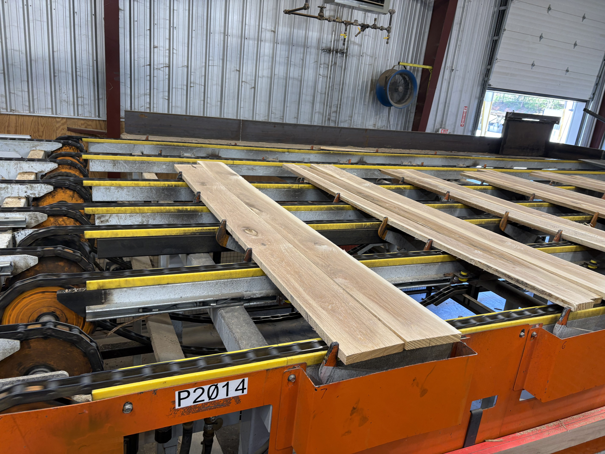
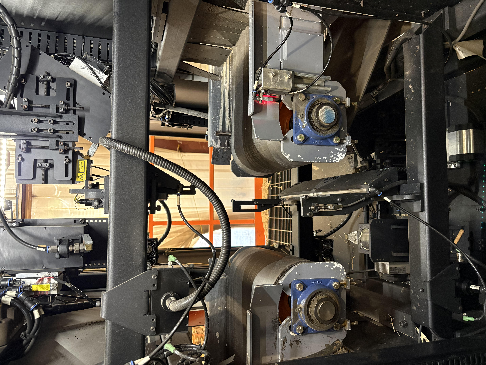
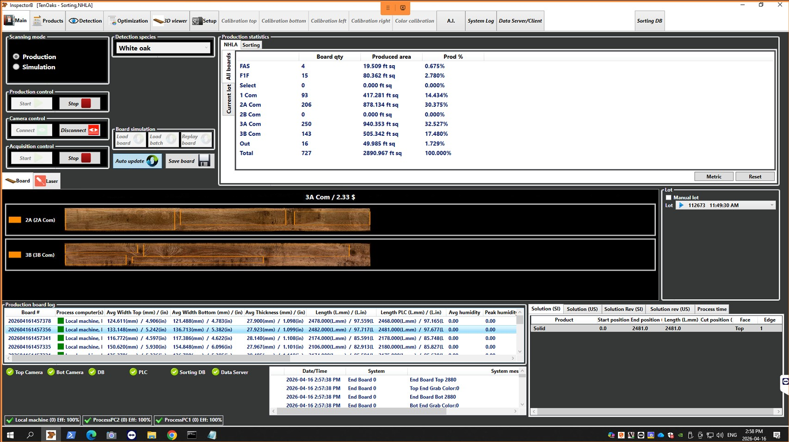
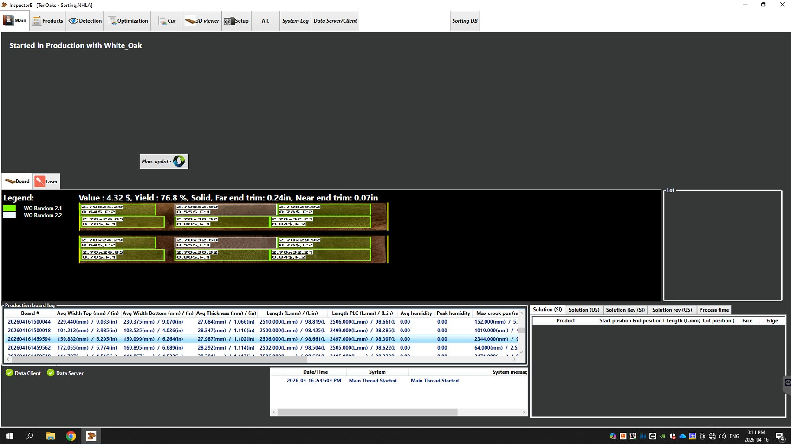
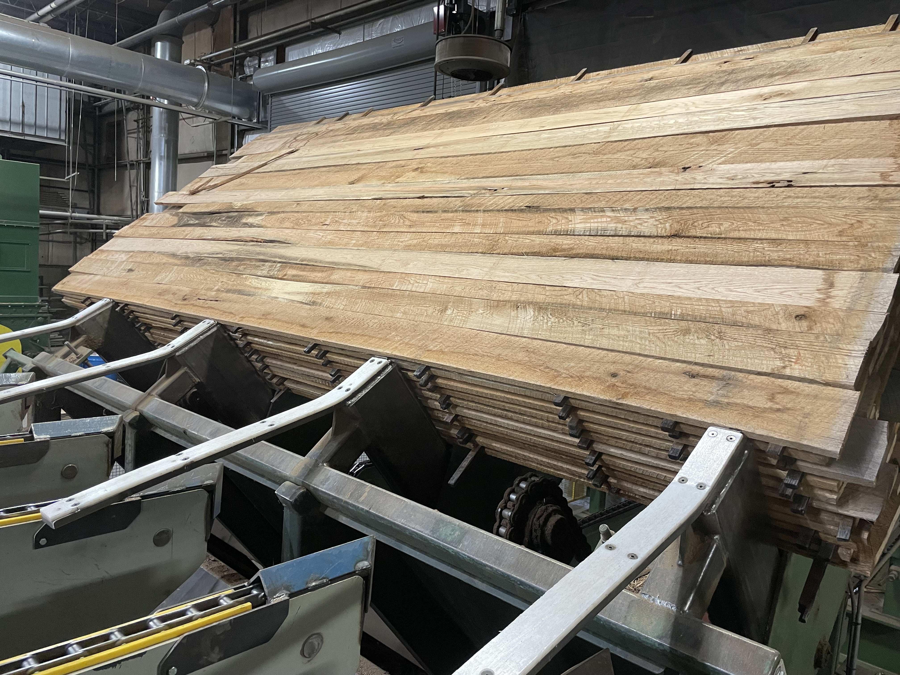
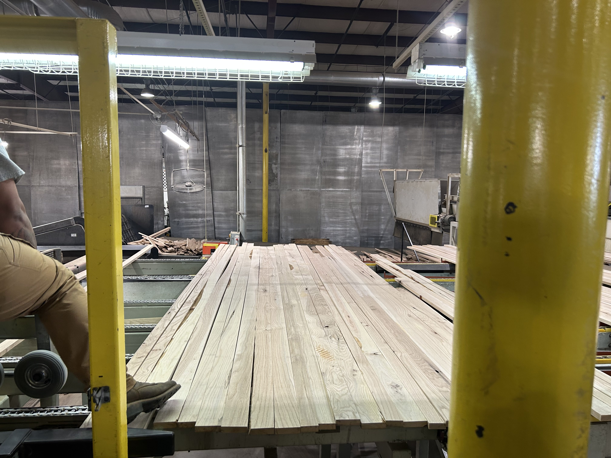
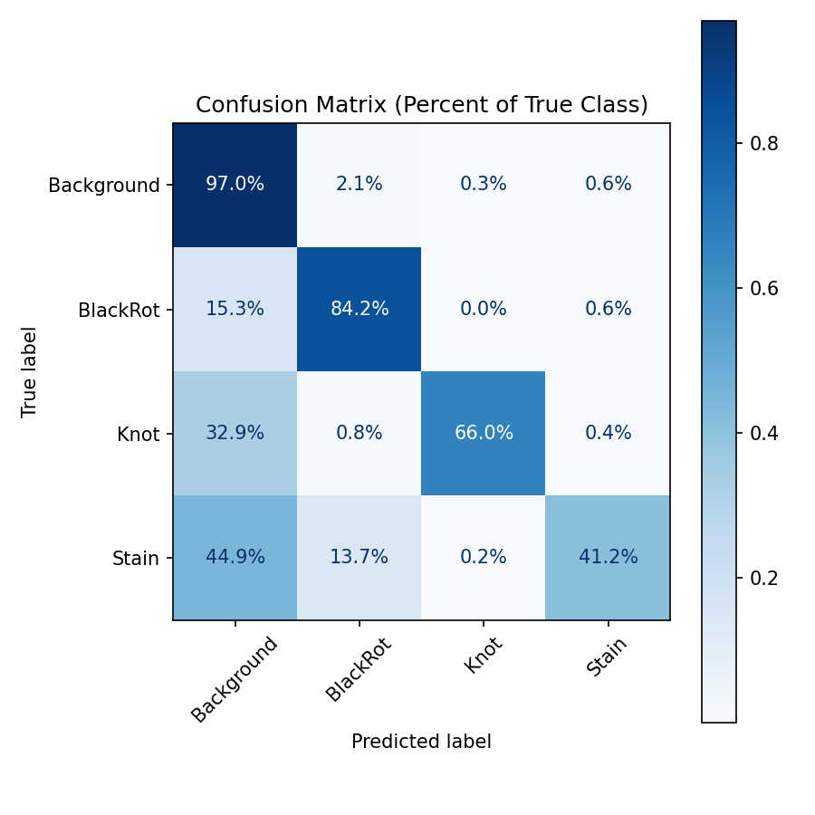

<!--
  Numbers: UNet Optuna rows from saved notebook outputs; DeepLabv3 Optuna from ONNX on test split (see Results slide footnote).
  To refresh CM PNGs: re-run evaluation cells, or regenerate DeepLab figure from `models/onnx/deeplabv3_fullimage_optuna.onnx` + `split.json` test IDs.
-->

# Oak defect detection

**Pixel-wise defect maps from line-scan imagery**

Nicholas Rodgers · Computer Vision Engineer · **Ten Oaks, LLC**

<!--
  About 30s: You solve grading/sorting for green rough oak using dense labels, not just boxes.
-->

---

## Current mill environment - Stacking Facility

Boards move from packs through scanning equipment before grading and downstream processing.

   

- **Pack infeed**: Green(not dried) lumber enters the facility in packs.
- **Board infeed**: Individual boards conveyed for inspection and grading.
- **Scanner cabinet**: Scanning and handling equipment.

---

## Scanner imaging - Stacking Facility

Examples of how our scanner camera system sees boards in production - Stacking

 

---

## Current mill environment - Flooring plant

Boards move from packs through scanning equipment before grading and downstream processing.

  

- **Pack infeed**: Kiln dried lumber enters the facility in packs.
- **Board infeed**: Individual boards conveyed for inspection and grading.
  - Boards are sent from the scanner to saws that cut the boards into pieces based on scanner decision

---

## Scanner imaging - Flooring Plant

Examples of how our scanner camera system sees boards in production before going to the saws

---

## Why this problem

- Mill throughput and consistent grading depend on **reliable defect cues** on every board.
- Many defects are **irregular in shape** — **semantic segmentation** gives a full surface map.
- **Goal**: a **reproducible** pipeline from raw scans to **identify** defects in oak planks that is **compatible** with our scanner manufacturer’s (**EBI**) ONNX runtime.

<!--
  Speaker: Connect to their world — recovery, rework, customer claims — without overclaiming autonomy. Next slide is the EBI contract detail.
-->

---

## What we built

- **Trained models**: semantic segmentation (multiple backbones / heads explored).
- **Rigorous evaluation**: held-out test, IoU / F1 / accuracy / ROC / confusion matrix.
- **Exports**: **ONNX** for lightweight integration; verified runtime signatures where noted in notebooks.
- **Demo**: **Streamlit** app — load a checkpoint, run inference, visualize overlays (`notebooks/app.py`).

<!--
  Speaker: Emphasize traceability — same splits and metrics across experiments.
-->

---

## Data

- **Source**: line-scan RGB **TIFFs** (industrial-style plank imagery).
- **Public release**: [Hugging Face — nrodgers98/Oak-Defect-Detection](https://huggingface.co/datasets/nrodgers98/Oak-Defect-Detection) (~1.5k samples, **CC BY-NC 4.0**).
- **Typical classes**: Background, **BlackRot**, **Knot**, **Stain** 

---

## Pipeline (raw scans → training)

1. **Raw TIFFs** → audit & **normalize** defect names  
2. **Filter** rare classes (explicit threshold)  
3. **Reorganize** — aligned image/mask pairs, validate, quarantine bad samples  
4. **Combined** multi-class masks + **train/val/test** split (JSON)  
5. **Train** — checkpoint on best **val IoU**

- Automation: `notebooks/functions/` (`data_pipeline`, filtering, splits, HF download helper).

---

## Architectures explored

| Approach | Notes |
|----------|--------|
| **ResNet34–UNet** | Full image, patch training variant, **Optuna** tuning notebooks |
| **ResNet34–U-Net++** | Full image + Optuna variant |
| **ResNet34–DeepLabV3** | Full image + Optuna; ONNX export path in notebook |
| **Other Architectures** | various other architectures(Yolo, FPN) |

---

## Hyperparameters (Optuna)

- **Tool**: [Optuna](https://optuna.org/) (TPE-style search) on selected notebooks.
- **Examples of tuned knobs**: batch size, learning rate, weight decay, optimizer choice — *exact ranges in each `*_Optuna.ipynb`*.
- **Objective**: maximize **validation IoU** (early stopping on plateau / best epoch per trial).

---

## How we measure quality

- **Segmentation**: per-class **IoU**, **mean IoU**
- **Classification-style**: macro / per-class **F1**, pixel **accuracy**.
- **Diagnostics**: one-vs-rest **ROC-AUC**, **confusion matrix** (normalized).
- **Rule**: metrics computed on **test** images only after choosing the best val checkpoint.

---

## Results — test metrics (from notebooks)

**Breadth over a single hero model**: same evaluation pattern (**held-out test**, row-normalized **confusion matrix**, IoU / F1 / accuracy). Class sets **differ by experiment** — always cite the notebook.

| Notebook | Classes (defects) | Mean IoU (excl. bg) | Macro F1 | Pixel acc. |
|----------|-------------------|---------------------|----------|------------|
| [`Unet_FullImage_Optuna.ipynb`](../notebooks/Unet_FullImage_Optuna.ipynb) | BlackRot, Knot, Stain | 0.461 | 0.703 | 0.913 |
| [`Unet++_FullImage_Optuna.ipynb`](../notebooks/Unet++_FullImage_Optuna.ipynb) | BlackRot, Knot, Stain | 0.477 | 0.720 | 0.934 |
| [`DeepLabv3_FullImage_Optuna.ipynb`](../notebooks/DeepLabv3_FullImage_Optuna.ipynb) | BlackRot, Knot, Stain | 0.509 | 0.740 | 0.923 |

*UNet rows: metrics from **saved** notebook outputs. DeepLabv3 Optuna: same **test split** and preprocessing size (384×1024), metrics and confusion matrix from **`models/onnx/deeplabv3_fullimage_optuna.onnx`** (notebook had no embedded evaluation figure). Re-run the notebook evaluation cell to align with a fresh `.pt` checkpoint if needed.*

<!--
  Speaker: All three rows are Optuna-tuned. UNet Optuna, UNet++, and DeepLab are all four-way on the test set (Background + BlackRot, Knot, Stain).
-->

---

## Confusion matrix — `DeepLabv3_FullImage_Optuna.ipynb`

<!--
  Speaker: DeepLabV3 + Optuna; CM artifact matches the EBI-style ONNX export used on the line scanner path.
-->

---

## Demo (30 seconds)

1. `streamlit run notebooks/app.py`
2. Pick backend (**PyTorch** or **ONNX**).
3. Select image → **Generate prediction** → show **overlay** and class map.

---

## Limitations and next steps

- **Data**: class imbalance; rare defects need more labels or revised taxonomy.
- **Generalization**: new lines, species, or lighting → expect **domain shift**; plan calibration data.
- **Operations**: human review for edge cases; optional **active learning** / feedback loops.

---

## Thank you

- **Repo**: Oak Defect Detection (this workspace)
- **Dataset**: [nrodgers98/Oak-Defect-Detection](https://huggingface.co/datasets/nrodgers98/Oak-Defect-Detection)
- **Questions**

---

<!-- _class: lead -->
## Backup — stack (if asked)

PyTorch · segmentation_models_pytorch · Albumentations · TensorBoard · Optuna · scikit-learn · Streamlit · ONNX Runtime · Hugging Face Hub

---

<!-- _class: lead -->
## Backup — project layout

`data/` (raw, filtered, organized) · `notebooks/` (training + `functions/`) · `models/` · `logs/` · Streamlit `app.py`
